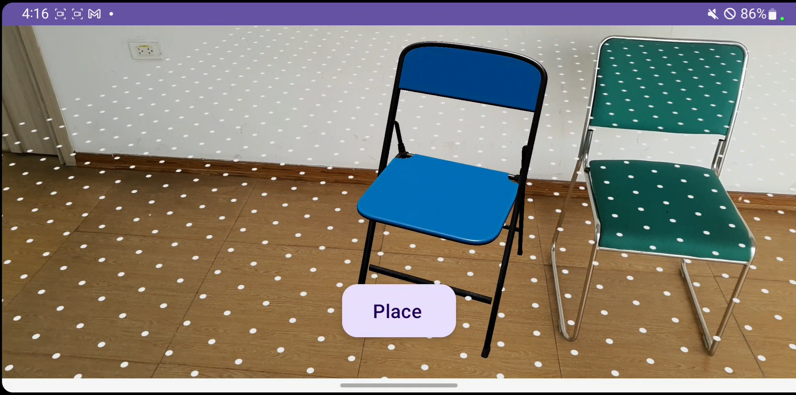

# ar-simple-ikea-place
### By Group 09 -  INT3414 20
A simple clone version of IKEA Place

### Prerequisites
- Android Studio
- Android devices with ARCore supported

### How to run?
1. Open the project in Android Studio
2. Turn on the Developer mode on Android device
3. Connect the Android device by USB or Wifi and turn on debugging mode (https://developer.android.com/studio/debug/dev-options)
4. Run the project on the Android device.

Here is the UI of the app:

### Technologies:
- Kotlin
- SceneView
- XML

